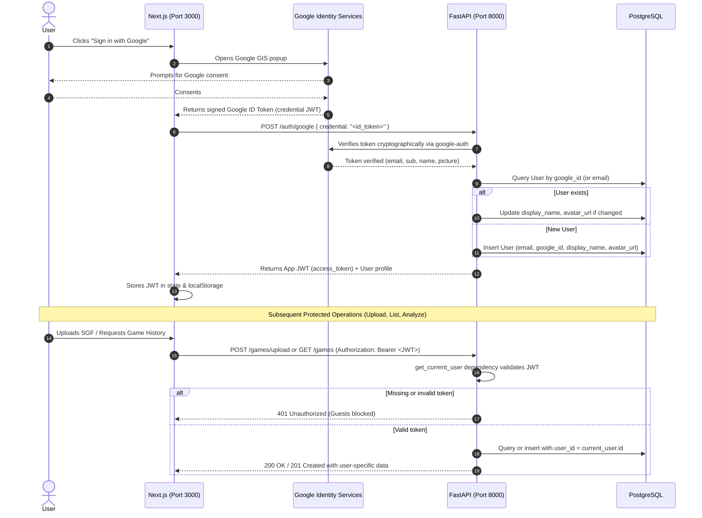

# Authentication Plan: Google OAuth & Game Ownership

## Decisions & Constraints

- **Mandatory Authentication**: Unauthenticated guests **cannot** upload or analyze games. Every game is strictly tied to the authenticated user (`user_id = current_user.id`).
- **Google OAuth Only**: No standard email/password signup flow for now to avoid the complexity of email verification and password resets.
- **No Mock Auth**: Direct implementation against real Google Identity Services (GIS) once the Google OAuth Client ID is provided.
- **Token Verification Pattern**: Google Identity Services (GIS) on Next.js frontend retrieves the signed Google ID Token (credential JWT) and forwards it to the FastAPI backend. FastAPI verifies the token cryptographically, upserts the user, and issues an internal JWT session token.

---

## Google Cloud Console Setup Guide

Before starting implementation, configure your Google Cloud OAuth Client ID:

1. **Open Google Cloud Console**:
   - Go to [Google Cloud Console: APIs & Services > Credentials](https://console.cloud.google.com/apis/credentials).
2. **Configure OAuth Consent Screen** (if not already done):
   - User Type: **External** (or Internal for Google Workspace).
   - App name: `Go Instructor`.
   - User support email & developer contact email: your email.
   - Scopes: `openid`, `.../auth/userinfo.email`, `.../auth/userinfo.profile`.
   - Test users (if in "Testing" status): Add the Google accounts you intend to log in with.
3. **Create OAuth 2.0 Client ID**:
   - Application type: **Web application**.
   - Name: `Go Instructor Web Client`.
   - **Authorized JavaScript origins**:
     - `http://localhost:3000`
     - `http://localhost`
   - **Authorized redirect URIs**:
     - Not strictly required for the popup/GIS flow, but you can add `http://localhost:3000` as a fallback.
4. **Environment Variables**:
   - Once generated, copy the **Client ID** (e.g. `123456789-abcdef.apps.googleusercontent.com`).
   - Add to `backend/.env`:
     ```env
     GOOGLE_CLIENT_ID=your-google-client-id.apps.googleusercontent.com
     JWT_SECRET_KEY=generate-a-secure-random-secret
     ```
   - Add to `frontend/.env.local`:
     ```env
     NEXT_PUBLIC_GOOGLE_CLIENT_ID=your-google-client-id.apps.googleusercontent.com
     NEXT_PUBLIC_API_URL=http://localhost:8000
     ```

---

## Architecture Flow



---

## Database Changes

### 1. `users` Table Updates
Update `backend/app/models/game.py`:
- `google_id = Column(String(255), unique=True, index=True, nullable=True)`
- `display_name = Column(String(255), nullable=True)`
- `avatar_url = Column(String(500), nullable=True)`

### 2. Alembic Migration
Run:
```bash
cd backend && alembic revision --autogenerate -m "add google_id and profile fields to users"
cd backend && alembic upgrade head
```

---

## Backend Implementation Plan

### 1. Dependencies & Config
- Add `pyjwt` to `backend/requirements.txt` (`google-auth` is already installed).
- Update `backend/app/config.py`:
  - `google_client_id: str = ""`
  - `jwt_secret_key: str = "secret-key-change-in-production"`
  - `jwt_algorithm: str = "HS256"`
  - `jwt_access_token_expire_minutes: int = 10080` (7 days)

### 2. Services (`backend/app/services/auth_service.py`)
- `verify_google_credential(credential: str) -> dict`:
  Validates token with `google.oauth2.id_token.verify_oauth2_token`.
- `create_app_token(user_id: int) -> str`:
  Encodes app session JWT.
- `get_or_create_google_user(db: Session, payload: dict) -> User`:
  Fetches or creates the user in PostgreSQL.

### 3. Dependencies (`backend/app/dependencies/auth.py`)
- `get_current_user(db: Session = Depends(get_db), token: str = Depends(oauth2_scheme)) -> User`:
  Validates `Authorization: Bearer <token>`, fetches user, raises `401 Unauthorized` if invalid or missing.

### 4. Router (`backend/app/routers/auth.py`)
- `POST /auth/google`:
  Exchanges Google credential for app JWT and user info.
- `GET /auth/me`:
  Returns the currently logged-in user profile.

### 5. Securing Game Endpoints (`backend/app/routers/games.py`)
Strictly enforce user ownership across all endpoints:
- `POST /games` and `POST /games/upload`: Requires `current_user: User = Depends(get_current_user)`. Sets `user_id = current_user.id`.
- `GET /games`: Requires `current_user: User = Depends(get_current_user)`. Filters to only return games where `Game.user_id == current_user.id`.
- `GET /games/{id}`, `DELETE /games/{id}`, `POST /games/{id}/analyze`, `GET /games/{id}/analysis`:
  Requires `current_user: User = Depends(get_current_user)`. Rejects request if `game.user_id != current_user.id` (404/403).

---

## Frontend Implementation Plan

### 1. Google Identity Services Setup
- In Next.js, load Google GIS script or `@react-oauth/google`.
- Load `NEXT_PUBLIC_GOOGLE_CLIENT_ID` from `frontend/.env.local`.

### 2. Auth State & API Client
- Create `AuthContext.tsx`:
  - Handles login, logout, user profile, and storing access token in `localStorage`.
  - Exposes `useAuth()` hook.
- Create API helper to automatically attach `Authorization: Bearer <token>` to requests.

### 3. UI Flow
- **Guest / Logged-Out View**:
  - Landing hero page explaining Go Instructor.
  - "Sign in with Google" button.
  - Uploading / analyzing disabled or prompts login dialog.
- **Authenticated View**:
  - Top bar with avatar, name, and logout button.
  - SGF File Uploader (enabled).
  - "My Games" dashboard displaying previous games, analysis statuses, and links to game reviews.

---

## Execution Readiness Checklist

- [ ] Google Cloud Console OAuth Client ID created.
- [ ] `GOOGLE_CLIENT_ID` set in `backend/.env`.
- [ ] `NEXT_PUBLIC_GOOGLE_CLIENT_ID` set in `frontend/.env.local`.
- [ ] Ready to run Alembic migration and implement backend auth modules.
